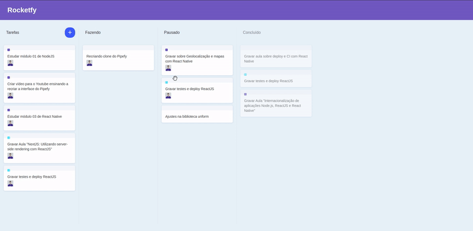

# React paperfy clone

Implementação visual do paperfy conforme [vídeo da RocketSeat](https://www.youtube.com/watch?v=awRtgpRsdTQ), com acréscimo de incluir cartão se soltado em cima da lista. Nessa implementação são utilizados os seguintes pacotes:

- [Styled Components](https://styled-components.com/docs) (Estilização CSS via Javascript);
- [React Icons](https://react-icons.netlify.com/#/icons/md) e
- [React Dnd](https://react-dnd.github.io/react-dnd/about) (Lida com arrastar e soltar de elementos).

---

## Demo

## Como executar a aplicação

Navegue até a pasta do projeto e execute o seguinte comando no terminal:

### Via Yarn:

`yarn && yarn start`

### Via Npm:

`npm install && npm run start`
